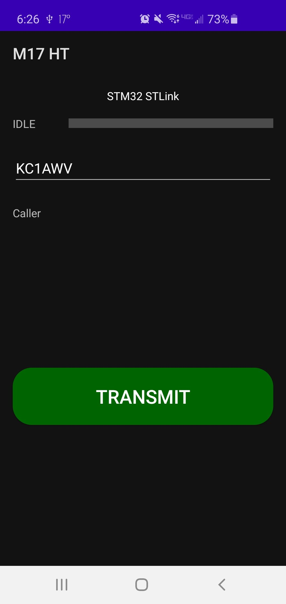

# M17 KISS HT
This is a fork of the (Android Codec2 Walkie-Talkie)[https://github.com/sh123/codec2_talkie],
updated to support M17 streaming KISS protocol over Bluetooth & USB.  THis is an Amateur Radio DV
(digital voice) communication protocol using the using open source vocoder,
[Codec2](https://github.com/drowe67/codec2).

# Introduction
This Android application is a digital voice frontend for your radio. It connects to your M17
KISS Bluetooth/USB modem, sends and receives M17 link setup and audio frames, which are
encapsulated inside KISS frames. It does not deal with radio management, modulation, etc.
I t is up to your modem and radio to do the M17 data link layer and physical layer.

# Requirements
- Android 6.0 (API 23) or higher
- Modem or transceiver which supports
  [M17 KISS protocol](https://m17-protocol-specification.readthedocs.io/en/latest/kiss_protocol.html)
  over Bluetooth or USB

# Features
- **PTT button**, push and talk, Codec2 speech frames will be transmitted to the modem
- **USB serial connectivity** (38400 bps, 8 data bits, 1 stop bit, no parity), just select this app after connecting to USB and it will use given connection
- **Bluetooth connectivity** on startup, lists paired devices, so you can choose your modem and connect, you need to pair with your Bluetooth device first from Android Bluetooth Settings

# Suitable radios and modems
- Tested, works:
  - None yet
- Tested, works, but not too stable, probably needs TXTail tuning:
  - None yet
- Could work, needs testing:
  - Nont yet

# Related Projects
- Codec2 codec: https://github.com/drowe67/codec2
- Android Codec2 wrapper code: https://github.com/UstadMobile/Codec2-Android
- Android USB serial: https://github.com/mik3y/usb-serial-for-android
- iOS Codec2 wrapper: https://github.com/Beartooth/codec2-ios
- M17 Project:
- Mobilinkd NucleoTNC:
- Mobilinkd TNC3:

# FAQ
- Gaps in received audio, indicator often changes between RX/IDLE on the receiver side when sender and recipient are close by then 
  - most likely you do not have enough bandwidth, use higher throughput modem mode, for LoRa modems you need approximately 170% of data rate for the given codec2 bitrate, AFSK1200 modems should work at 450 bps codec2 mode, 700 bps might work, but not on all modems, higher speed codec2 modes won't work on AFSK1200
  - modem goes into RX state too fast after sending first packet, increase TxTail parameter for your modem if it does not handle corresponding KISS command, so it will stay longer in TX before switching to RX
    - if you are using LibAPRS based modem, set TxTail and TxPreamble programatically by using `APRS_setPreamble` and `APRS_setTail` methods as it does not seem to set these values from `CMD_TXDELAY` and `CMD_TXTAIL` KISS commands
  
# TODO
- Parrot mode, so speech coming from aether will be transmitted back (testing or digirepeating)
- QSO log, voicemail style recording of incoming speech so that incoming transmissions are not missed
- Separate settings to avoid repeated operations
  - Override default USB serial parameters
  - Default Bluetooth device name to connect upon startup
  - Default codec2 bitrate on startup
  - Settings for parrot mode
  - Settings for QSO log
- Modem profiles, so different modems could be controlled from the UI with KISS command extensions, so that user can change frequency, modulation scheme or other modem parameters on the fly.
